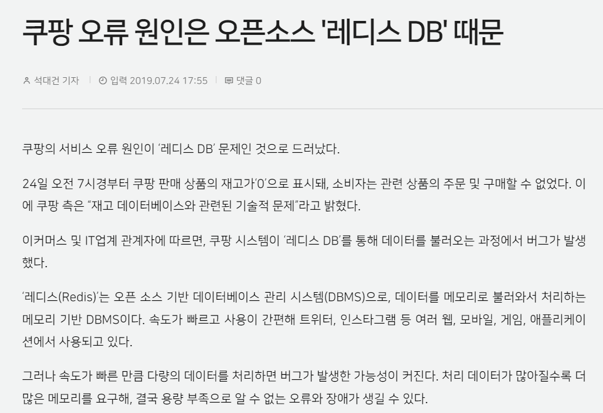

# DB


# 04/04


## 1. Key

Key 란? : 검색, 정렬 시 Tuple을 구분할 수 있는 기준이 되는 Attribute


### (1) 후보키 - Candidate Key

- 릴레이션 구성 속성들 중 튜플을 **유일하게 식별할 수 있는 속성들의 부분집합**
- **모든 릴레이션은 반드시 하나 이상의 후보키를 가져야**한다.
- **유일성과 최소성을 만족**

= 기본키가 될 수 있는 키들

ex) 학생의 학번과 주민번호


### (2) 기본키 - Primary Key

- 후보키 중 주키
- 특정 튜플을 **유일하게 구별**할 수 있는 속성
- **Null값을 가질 수 없다.**
- **동일 값을 중복 저장할 수 없다**.

ex) 학번을 기본키로 할 수 있음.

+) 기본키가 여러 컬럼으로 구성됐다면 복합키라고 부름.


### (3) 대체키 - Alternate Key

- 후보키가 둘 이상일 때 기본키 제외한 나머지 후보키들

ex) 학번이 기본키면 주민번호는 대체키가 됨


### (4) 슈퍼키 - Super Key

- 한 릴레이션 내 속성들의 집합으로 구성된 키

- **유일성은 만족하지만 최소성은 만족하지 못함.**

ex) 슈퍼키는 '학번', '주민번호', '학번'+'주민번호', '학번'+'주민번호'+'성명' 등으로 구성할 수 있음.

'학번'+'주민번호'+'성명'을 슈퍼키로 사용했을 경우 3개의 속성 조합을 통해 다른 튜플들과 구별이 가능해지지만, '성명' 단독적으로 슈퍼키를 사용했을 때는 구별이 가능하지 않기 때문에 최소성을 만족시키지 못함. 즉, 뭉쳤을 경우에 유일성이 생기고, 흩어지면 몇몇 속성들은 독단적으로 유일성있는 키로 사용되지 못하는 경우 최소성을 만족하지 못한다고 함.


### (5) 외래키 - Foreign Key

- 관계를 맺고 있는 릴레이션 R1, R2에서, R1이 참조하고 있는 R2의 기본키와 같은 R1의 속성
- 외래키는 참조되는 릴레이션의 기본키와 대응되어 릴레이션 간 참조 관계를 표현하는데 중요한 도구로 사용됨.
- 외래키로 지정되면 참조 테이블의 기본키에 없는 값은 입력할 수 없게 됨. (참조 무결성 조건)

각 릴레이션 입장에서 속성은 기본키가 되기도, 외래키가 되기도 함.


## 2. SQL - JOIN

### (1) 조인이란?

- 두 개 이상의 테이블이나 데이터베이스를 연결하여 데이터를 검색하는 방법

### (2) 조인의 종류

- inner join


- left outer join


- right outer join


- full outer join


- cross join


- self join


## 3. SQL - Injection

- 해커에 의해 조작된 SQL 쿼리문이 DB에 그대로 전달되어 비정상적 명령을 실행시키는 공격 기법

### (1) 공격 방법

1. 인증 우회

   - 보통 로그인시, id pw를 input창에 입력하게 된다.

   > SELECT * FROM USER WHERE ID="abc" AND PASSWORD="1234";

   - 이 때, id에 쿼리문을 입력해서 악용할 수 있다.

   id에 `1' or '1'='1`를 입력하면...

   > ~ ID = '1' or '1'='1' ~

   가 되면서 항상 True인 구문이 되어버린다. 즉, WHERE 구문이 우회된 채로 SQL 쿼리문이 실행되기 때문에 DB내 모든 사용자 정보가 노출된다.


2. 데이터 노출
   - 시스템에서 발생하는 에러 메시지는, 보통 개발자가 버그를 수정할 때 도움을 받을 수 있게 해준다. 하지만 해커들은 이를 역이용해 악의적인 구문을 삽입하여 에러를 유발시킨다.
   - 예를 들면, GET방식으로 동작하는 URL의 쿼리 스트링을 조작하여 에러를 발생시킨다. 이에 해당하는 오류가 발생하면, 이를 통해 해당 웹앱의 데이터베이스 구조를 유추할 수 있고, 해킹에 활용하게 된다.


### (2) 방어 방법

1. input 값을 받을 때, 특수문자 여부 검사하기
   - 검증 로직을 추가하여 미리 설정한 특수문자들이 들어왔을 때 요청을 막아낸다.
2. SQL 서버 오류 발생 시, 해당하는 에러 메시지 감추기
   - view를 활용하여 원본 DB 테이블에는 접근 권한을 높힌다. 일반 사용자는 view로만 접근하여 에러를 볼 수 없도록 만든다.
3. preparestatement 사용하기
   - preparestatement를 사용하면, 특수문자를 자동으로 escaping 해준다.
   - `PreparedStatement pstmt = conn.prepareStatement(sql)`


## 4. SQL vs NoSQL

MySQL과 같은 SQL을 사용할까, 아니면 MongoDB와 같은 NoSQL을 사용할까?

보통 Spring에서 개발할 때 MySQL을, Node.js에서는 MongoDB를 주로 사용한다.

하지만 단순히 프레임워크에 따라 결정하는 게 아니라, 적합한 데이터베이스를 택해야 한다.


### (1) SQL - 관계형 DB

SQL을 사용하면, RDBMS(관계형 데이터데이스 관리 시스템)

관계형 데이터베이스의 핵심적인 두 특징은

1. 데이터는 **정해진 데이터 스키마에 따라 테이블에 저장**된다.
2. 데이터는 **관계를 통해 여러 테이블에 분산**된다.

즉, 스키마(테이블마다 명확히 정의된 구조)를 준수하지 않은 레코드는 테이블에 추가할 수 없다.

또한, 데이터의 중복을 피하기 위해 '관계'를 이용한다.


### (2) NoSQL - 비관계형 DB

말 그대로 반대이다.

**스키마도 없고, 관계도 없다.**

NoSQL에서는 레코드를 문서라고 부른다. (문서는 보통 Json 형태로 저장됨)

서로 다른 구조의 데이터를 같은 컬렉션에 추가할 수 있다. 따라서 여러 테이블에 조인할 필요 없이 이미 여러 테이블이 한 문서에 있는 것이 NoSQL이다. (Join 개념이 존재하지 않음)

따라서, 조인을 잘 사용하지 않고, 자주 변경되지 않는 데이터일 때 NoSQL을 쓰면 상당히 효율적이다.


### (3) 확장 개념

데이터베이스 서버 확장성은 '수직적'/'수평적' 확장으로 나뉨

- 수직적 확장 : 단순히 DB서버 성능의 향상 (ex. CPU 업그레이드)
- 수평적 확장 : 더 많은 서버가 추가되고 DB가 전체적으로 분산됨을 의미 (하나의 DB에서 작동하지만 여러 호스트에서 작동)

하지만 데이터 저장 방식으로 인해 SQL DB는 일반적으로 수직적 확장만 지원함.


### (4) 장단점

SQL 장점

- 명확하게 정의된 스키마, 데이터 무결성 보장.
- 관계는 각 데이터를 중복없이 한 번만 저장.

SQL 단점

- 덜 유연. 데이터 스키마를 사전에 계획하고 알아야 함. (추후 수정 어려움)
- join문이 많은 복잡한 쿼리가 만들어질 수 있음.
- 대체로 수직적 확장만 가능.

NoSQL 장점

- 유연함. 언제든 데이터 조정과 새 필드 추가 가능.
- 데이터는 애플리케이션이 필요로 하는 형식으로 저장됨. 데이터 읽어오는 속도 빠름.
- 수직/수평적 확장이 가능해서 모든 읽기/쓰기 요청 처리 가능

NoSQL 단점

- 유연성으로 인해 데이터 구조 결정을 미루게 될 수 있음.
- 데이터 중복을 계속 업데이트해야 함
- 데이터가 여러 컬렉션에 중복되어 있기 때문에, 수정 시 모든 컬렉션에서 수행해야 함.


### (5) 선택

SQL

- 관계를 맺고 있는 데이터가 자주 변경될 때,

- 변경될 여지가 없는 명확한 스키마가 사용자와 데이터에게 중요할 때.

NoSQL

- 정확한 데이터 구조를 알 수 없거나, 변경/확장 될 수 있을 때,
- 읽기는 자주 하지만, 변경은 자주 없을 때,
- DB를 수평적으로 확장해야 할 때 (막대한 양의 데이터를 다뤄야 할 때)


하지만 SQL을 선택해서 복잡한 JOIN문을 만들지 않도록 설계하여 단점을 보완할 수도,

NoSQL을 선택해서 중복 데이터를 줄이는 방법으로 설계해서 단점을 보완할 수도 있다.


# 04/11


## 5. 정규화

정규화의 목표  :

- 데이터 중복을 없에고 불필요한 데이터 최소화시킨다. 
- 무결성을 지키고, **이상** 현상 방지한다.
- 테이블 구성을 논리적이고 직관적이게 한다.
- DB구조 확장이 용이해진다.


### (1) 제 1정규화 - 1NF

> 정규화 : Normalization, 정규형 : Normal Form (NF)

테이블 컬럼이 **원자값(하나의 값)을 갖도록** 테이블을 분리시키는 것.

조건 :

- 어떤 릴레이션에 속한 모든 도메인이 원자값만으로 되어 있어야 한다.
- 모든 속성에 반복되는 그룹이 나타나지 않는다.
- 기본키를 사용하여 관련 데이터의 각 집합을 고유하게 식별할 수 있어야 한다.


전화번호가 여러개 있어서 원자값이 아님. 따라서 아래와 같이 분리.


### (2) 제 2정규화 - 2NF

테이블 모든 컬럼이 **완전 함수 종속**을 만족해야 한다.

> = 기본키의 부분집합 키가 결정자가 되어선 안된다.
>
> = 기본키가 복합키로 묶여있을 때, 두 키 중 하나의 키만으로 다른 컬럼을 결정할 수 있으면 안된다.


 

Manufacturer 과 Model 이 키가 되어 Model Full Name을 알 수 있다.

근데 Manufacturer 만으로 Manufacturer Country를 결정할 수 있다. (부분 함수 종속)

> 기본키만으로 모든 컬럼을 결정하면 "완전 함수 종속" (결정자와 종속자)
>
> 위와 같은 경우는 "부분 함수 종속"
>
> X->Y 이고 Y->Z일 때 Y->X가 아니라면 X->Z이다. "이행적 종속"

따라서 Model은 Manufacturer Country와 연관이 없기 때문에, 부분 함수 종속인 부분을 떼어내서 완전 함수 종속인 두 테이블로 만들 수 있다.


### (3) 제 3정규화 - 3NF

2NF가 진행된 테이블에서 **이행적 종속을 없에기 위해** 테이블을 분리하는 것

 조건 :

- 릴레이션이 2NF에 만족한다.
- 기본키가 아닌 속성들은 기본키에 의존한다.


Tournament 와 Year 이 기본키(복합키)

Winner는 이 복합키를 통해 결정.

하지만 Winner Date of Birth는 복합키가 아닌 Winner에 의해 결정. (이행적 종속)

따라서 3NF를 위반하므로, 분리해야 한다.


## 6. 이상 - Anomaly

정규화를 해야 하는 이유는 잘못된 테이블의 설계로 인해 Anomaly(이상 현상)가 나타나기 때문이다.

Anomaly란?

### (1) 삽입 이상 - Insertion Anomaly

기본키가 {학번, 수강번호} 인 경우, 수업을 수강하지 않은 학생은 수강번호가 없는 현상이 발생함. 따라서 수강번호를 Null로 할 수밖에 없는데, 기본키는 Null이 될 수 없으므로 Table에 추가할 수 없음.

굳이 삽입하기 위해 '미수강'과 같은 수강번호를 만들어야 함. => 불필요한 데이터를 추가해야 삽입할 수 있는 상황 - Insertion Anomaly


### (2) 갱신 이상 - Update Anomaly

어떤 학생의 전공을 "기계"에서 "컴퓨터"로 바꿀 경우, 모든 Department를 "컴퓨터"로 바꿔야 함. 그러나 일부를 깜빡하고 바꾸지 못한 경우, 제대로 파악할 수 없게 됨. => 일부만 변경하여, 데이터의 불일치가 발생하는 모순의 문제 - Update Anomaly


### (3) 삭제 이상 - Deletion Anomaly

어떤 학생이 수강 철회할 경우, {학번, 전공, 수강번호, 학년} 의 정보 중, 학번, 전공과 같은 학생에 대한 정보도 사라지게 됨.

튜플 삭제로 인해 필요한 데이터가 함께 삭제되는 문제 - Deletion Anomaly


## 7. 인덱스 - Index

추가적인 쓰기 작업과 저장 공간을 활용하여 데이터베이스 테이블의 검색 속도를 향상시키기 위한 자료구조

두꺼운 책의 목차와 비슷하다.


### (1) 장점

- 테이블 검색속도와 성능이 향상된다.
- 데이터들이 정렬된 형태를 갖게 된다. (where문으로 전체를 비교하는 Full Table Scan이 아닌, Index로 검색하게 됨.)


### (2) 단점

- 인덱스 관리를 위한 추가 작업이 필요하다.
- 추가 저장 공간 필요하다.
- 잘못 사용하는 경우 오히려 성능이 저하될 수 있다.

인덱스의 추가/수정/삭제도 필요하기 때문에, 데이터 수정이 잦은 경우 성능이 저하될 수 있다.

또, 데이터의 인덱스를 제거하는 것이 아니라 '사용하지 않음'처리하기 때문에, 수정 작업이 많은 경우 실제 데이터에 비해 인덱스가 과도하게 커지는 현상이 발생할 수 있다.


### (3) 인덱스를 사용하면 좋은 경우

데이터의 range가 넓고, 중복이 적을 수록,

조회가 많거나, 정렬된 상태가 유용한 컬럼에 사용하는 것이 좋다.

- 규모가 큰 테이블
- 삽입/수정/삭제가 자주 발생하지 않는 컬럼
- WHERE나 ORDER BY, JOIN등이 자주 사용되는 컬럼
- 데이터의 중복도가 낮은 컬럼


### (4) Why?

그럼에도 불구하고 RDBMS에서 인덱스는 필수이다.

일반적인 OLTP(Online Transaction Processing, 온라인 트랜잭션 처리)시스템에서 데이터 조회 업무가 90% 이상이기 때문이다.

웹 애플리케이션의 백엔드 성능을 높이려고 종종 실행하는 SQL 튜닝이란,

SQL이 위에서 알아본 인덱스를 활용하도록 SQL을 수정하는 것이라고 할 수 있다.


# 04/18


## 8. DB 트랜잭션 (Transaction)

트랜잭션이란? : 작업의 **완전성**을 보장해주는 것. / 데이터베이스의 상태를 변화시키기 위해 수행하는 작업 단위.


작업단위 : 많은 SQL 명령문들을 사람이 정하는 기준에 따라 정하는 것

> 예시 ) 사용자 A가 사용자 B에게 만원을 송금한다.
>
> * 이때 DB 작업
>
> 1. 사용자 A의 계좌에서 만원을 차감한다. : UPDATE문으로 A의 잔고 변경
> 2. 사용자 B의 계좌에 만원을 추가한다. : UPDATE문으로 B의 잔고 변경
>
> 현재 작업 단위 : 출금 UPDATE문 + 입금 UPDATE문
>
> -> 이를 통틀어 하나의 트랜잭션이라고 한다.
>
> - 두 쿼리문이 모두 성공적으로 완료되어야 "하나의 트랜잭션"이 완료되는 것이다. 'Commit'
> - 하나라도 실패하면 모든 쿼리문을 취소하고 이전 상태로 돌려놓아야 한다. 'Rollback'


즉, 하나의 트랜잭션을 잘 설계하는 것이 데이터를 다룰 때 많은 이점을 가져다준다.

- Commit : 하나의 트랜잭션이 성공적으로 끝났고, DB가 일관성있는 상태일 때 이를 알려주기 위해 사용하는 연산
- Rollback : 하나의 트랜잭션 처리가 비정상적으로 종료되어 트랜잭션 원자성이 깨진 경우, last consistent state로 roll back할 수 있음.


### (1) 트랜잭션의 특징

Transaction은 ACID라는 4가지 특성을 만족해야 한다.

- 원자성 - Atomicity
  - 트랜잭션이 DB에 모두 반영되거나, 혹은 전혀 반영되지 않아야 한다.
- 일관성 - Consistency
  - 트랜잭션의 작업 처리 결과는 항상 일관성이 있어야 한다.
- 독립성 - Isolation
  - 각각의 트랜잭션은 서로 간섭없이 독립적으로 수행되어야 한다.
- 지속성 - Durabilty
  - 트랜잭션이 성공적으로 반영되면, 결과는 영구적으로 반영되어야 한다.


### (2) 트랜잭션의 상태

- Active
  - 트랜잭션의 활동 상태. 트랜잭션이 실행 중이며 동작 중인 상태를 말한다.
- Failed
  - 트랜잭션 실패 상태. 트랜잭션이 더 이상 정상적으로 진행할 수 없는 상태를 말한다.
- Partially Committed
  - 트랜잭션의 Commit명령이 도착한 상태. 트랜잭션의 Commit이전 SQL문이 수행되고 Commit만 남은 상태를 말한다.
- Committed
  - 트랜잭션이 완료된 상태. 트랜잭션이 정상적으로 완료된 상태를 말한다.
- Aborted
  - 트랜잭션이 취소 상태. 트랜잭션이 취소되고 트랜잭션 실행 이전 데이터로 돌아간 상태를 말한다.


### (3) 트랜잭션과 Lock

잠금(Lock)과 트랜잭션은 다른 개념이다.

#### ① 잠금

- **동시성**을 제어하기 위한 기능.

- 여러 커넥션에서 동시에 동일한 자원(레코드/테이블)을 요청할 경우, 한 시점에는 하나의 커넥션만 순서대로 변경할 수 있게 해주는 역할을 한다.

#### ② 트랜잭션

- 데이터의 **정합성**을 보장하기 위한 기능.
- 꼭 여러 작업을 수행하는 쿼리가 조합되어야 의미있는 개념은 아니다.
- 하나의 논리적인 작업 셋 자체가 100% 적용되거나 아무것도 적용되지 않아야 함을 보장하는 것이다.


##  9. DB의 교착상태

>  Deadly Embrace, 죽음의 포옹이라고 표현하기도 한다.

### (1) 교착상태란?

교착상태란, 여러 개의 트랜잭션들이 실행을 하지 못하고 서로 무한정 기다리는 상태를 의미한다.

동시성 제어를 위해 잠금 기법을 사용하는데, 이러한 잠금은 데이터가 엉망진창이 되는 것을 막아주겠지만, 반면에 그 부작용으로 교착상태를 일으킬 수 있다는 것이 핵심이다.


### (2) 교착 상태 무시

교착상태가 드물게 발생하는 시스템에서 일반적으로 사용하는 방법

이유 : 교착상태 해결 비용을 지불하는 것이 효율적이지 못한 상황이기 때문.

윈도우와 유닉스를 포함한 대부분의 운영체제도 이 방법을 사용한다고 한다. (사용자가 직접 프로세스를 종료하거나, 재부팅하는 방법 등을 통해 직접 해결해야 한다.)


### (3) 교착상태를 해결하는 방법

크게 예방 기법과 회피 기법으로 나뉘는데, 예방 기법의 단점 때문에, 실제로 교착상태를 해결하기 위해 회피 기법이 많이 사용된다.

#### ① 예방 기법

각 트랜잭션이 실행되기 이전에, 필요한 데이터를 모두 잠금해주는 방법.

하지만, 데이터가 많이 필요한 작업단위의 경우 사실상 모든 데이터를 전부 잠금해줘야 하므로, 트랜잭션의 병행성을 보장하지 못하게 될 수 있다. 뿐만 아니라 몇몇 트랜잭션은 계속해서 처리를 못하게 되는 기아 상태가 발생할 수 있다.


#### ② 회피 기법

자원을 할당할 때 시간 스탬프를 사용하여 교착상태가 일어나지 않도록 회피하는 방법.

1. Wait-Die 방식 : 트랜잭션 Ti가 Tj에 의해 잠금된 데이터를 요청할 때, Ti가 먼저 들어온 트랜잭션이라면 기다린다(Wait). 반면 Ti가 나중에 들어온 트랜잭션이라면 포기(Die)하고, 나중에 다시 요청한다. 즉, 다른 트랜잭션이 데이터를 점유하고 있을 때 기다리거나(Wait) 포기(Die)하는 방식이다.
2. Wound-Wait방식 : 트랜잭션 Ti가 Tj에 의해 잠금된 데이터를 요청할 때, Ti가 먼저 들어온 트랜잭션이라면 데이터를 선점(Wound)한다. 반면 나중에 들어온 트랜잭션이라면 기다린다(Wait). 즉, 다른 트랜잭션이 데이터를 점유하고 있을 때 빼앗거나(Wound) 기다리는(Wait)방식이다.


### (4) 교착상태 탐지와 복구

우선... 회피 기법을 적용하기 위해서는, 자원을 요청할 때마다 회피 알고리즘을 실행해야 하기 때문에, 오버헤드가 굉장히 크다. 때문에, 현실적으로 탐지와 복구를 많이 사용한다.

#### ① 탐지

교착상태가 발생했는지 알아내기 위해 사용하는 알고리즘은 Union-Find 알고리즘이다. 자원 할당을 그래프 형태로 표현하고, <u>사이클이 존재하는지의 여부로 교착상태가 발생했는지 확인할 수 있다.</u>


#### ② 복구

순환 대기를 깨서 교착 상태로부터 회복

- 순환 대기가 깨질 때까지 프로세스 종료
- 순환 대기에 포함된 프로세스의 제어권을 뺏고 롤백

어떤 프로세스를 선택할지는 시스템마다 다른 기준으로 우선 순위에 따라 결정된다. (남은 수행시간, 자원 유형의 수 등)

MySQL의 경우, 작업한 양이 가장 적은 트랜잭션을 희생양으로 삼고 교착상태로부터 벗어난다.


# 04/25

## 10. 저장 프로시저 (Stored Procedure)

> 프로시저 : 일련의 쿼리를 마치 하나의 함수처럼 실행하기 위한 쿼리의 집합

프로시저를 만들어두면, 애플리케이션에서 여러 상황에 따라 해당 쿼리문이 필요할 때 인자 값만 전달하여 쉽게 원하는 결과물을 받아낼 수 있다.


예시 :

```SQL
CREATE OR REPLACE PROCEDURE 프로시저명
	(매개변수명1 IN 데이터타입, 변수명2 IN 데이터타입) -- 인자 값은 필수X
IS
	변수, 상수 등 선언
BEGIN
	실행부 -- 인자 값 사용
[EXCEPTION
	예외처리부]
END;

EXEC 프로시저명; -- 호출
```


### (1) 프로시저 장점

1. 최적화 & 캐시
   - 프로시저의 최초 실행 시 최적화 상태로 컴파일 되며, 그 이후 프로시저 캐시에 저장된다.
     해당 프로세스가 여러번 사용될 때, 다시 컴파일하지 않고 캐시에서 가져와서 쓸 수 있다.
2. 유지 보수
   - 작업이 변경될 때, 다른 작업은 건드리지 않고 프로시저 내부에서 수정만 하면 된다. 
3. 트래픽 감소
   - 클라이언트가 직접 SQL문을 작성하지 않고, 프로시저명에 매개변수만 담아 전달하면 된다. 즉, SQL문이 서버에 이미 저장되어 있기 때문에 클라이언트와 서버 간 네트워크 상 트래픽이 감소된다.
4. 보안
   - 프로시저 내 참조중인 테이블의 접근을 막을 수 있다.


### (2) 프로시저 단점

1. 호환성
   - 구문 규칙이 SQL/PSM 표준과의 호환성이 낮기 때문에 코드 자산으로의 재사용성이 나쁘다.

> SQL/PSM : 프로그래밍 언어 기능이 포함된 SQL. 주로 저장 프로시저에 사용하기 위함.

2. 성능
   - 문자 또는 숫자 연산에서 프로그래밍 언어인 C나 Java보다 성능이 느리다.
3. 디버깅
   - 에러 발생시, 어디서 잘못됐는지 디버깅이 상대적으로 힘들다.


## 11. 레디스 (Redis)

### (1) 레디스란?

Remote **Dictionary** Server

- Dictionary 자료구조(HashMap과 같은, Key-Value형태) 사용

- 오픈 소스 소프트웨어

- **디스크가 아닌 메모리 기반** 데이터 저장소 (In-Memory data structure store)
- 명시적 삭제나 expire 설정이 없다면 데이터는 삭제되지 않는다. (=영구적 보존)
- NoSQL DBMS로 분류


디스크가 아닌 메모리 기반인데 영구적 보존...

안전한 데이터의 보관과 백업을 위한 두 가지 전략

1. 스냅샷 : 특정 시점을 디스크에 백업.
2. AOF : 명령들을 전부 저장. 서버 셧다운 시 재실행해서 다시 만들 수 있음.


### (2) 장단점

장점 :

1. 빠른 **속도**
   - 리스트형 데이터 입력과 삭제가 MySql에 비해 10배정도 빠름
2. 리스트, 배열과 같은 데이터 처리에 유용
   - value 값으로 다양한 데이터 형식 지원 (5가지 : string, set, sorted set, hash, list)
3. 메모리를 활용하면서 영속적인 데이터 보존
   - 스냅샷 기능을 제공해, 메모리 내용을 저장하여 특정 시점으로 복구할 수 있다. 
4. 싱글 쓰레드로 수행되기 때문에, 서버 하나에 여러 Redis Server를 띄울 수 있다.


단점 :

1. **메모리**를 2배로 사용
2. 디버깅이 상대적으로 어려움


실제 사례 :



실상은...

key값이 너무 많아져서 int의 범위를 넘어가서... (21억) 그래서 생긴 오류였다고 한다.


저장 프로시저

레디스

NoSQL


맵엔트리?

트리셋?
