# DB

# 04/04

## 1. Key

Key 란? : 검색, 정렬 시 Tuple을 구분할 수 있는 기준이 되는 Attribute

### (1) 후보키 - Candidate Key

- 릴레이션 구성 속성들 중 튜플을 **유일하게 식별할 수 있는 속성들의 부분집합**
- **모든 릴레이션은 반드시 하나 이상의 후보키를 가져야**한다.
- **유일성과 최소성을 만족**

= 기본키가 될 수 있는 키들

ex) 학생의 학번과 주민번호

### (2) 기본키 - Primary Key

- 후보키 중 주키
- 특정 튜플을 **유일하게 구별**할 수 있는 속성
- **Null값을 가질 수 없다.**
- **동일 값을 중복 저장할 수 없다**.

ex) 학번을 기본키로 할 수 있음.

+) 기본키가 여러 컬럼으로 구성됐다면 복합키라고 부름.

### (3) 대체키 - Alternate Key

- 후보키가 둘 이상일 때 기본키 제외한 나머지 후보키들

ex) 학번이 기본키면 주민번호는 대체키가 됨

### (4) 슈퍼키 - Super Key

- 한 릴레이션 내 속성들의 집합으로 구성된 키

- **유일성은 만족하지만 최소성은 만족하지 못함.**

ex) 슈퍼키는 '학번', '주민번호', '학번'+'주민번호', '학번'+'주민번호'+'성명' 등으로 구성할 수 있음.

'학번'+'주민번호'+'성명'을 슈퍼키로 사용했을 경우 3개의 속성 조합을 통해 다른 튜플들과 구별이 가능해지지만, '성명' 단독적으로 슈퍼키를 사용했을 때는 구별이 가능하지 않기 때문에 최소성을 만족시키지 못함. 즉, 뭉쳤을 경우에 유일성이 생기고, 흩어지면 몇몇 속성들은 독단적으로 유일성있는 키로 사용되지 못하는 경우 최소성을 만족하지 못한다고 함.

### (5) 외래키 - Foreign Key

- 관계를 맺고 있는 릴레이션 R1, R2에서, R1이 참조하고 있는 R2의 기본키와 같은 R1의 속성
- 외래키는 참조되는 릴레이션의 기본키와 대응되어 릴레이션 간 참조 관계를 표현하는데 중요한 도구로 사용됨.
- 외래키로 지정되면 참조 테이블의 기본키에 없는 값은 입력할 수 없게 됨. (참조 무결성 조건)

각 릴레이션 입장에서 속성은 기본키가 되기도, 외래키가 되기도 함.

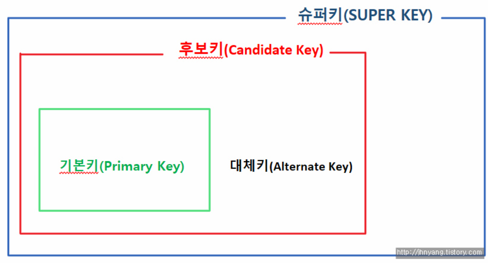

## 2. SQL - JOIN

### (1) 조인이란?

- 두 개 이상의 테이블이나 데이터베이스를 연결하여 데이터를 검색하는 방법

### (2) 조인의 종류

- inner join

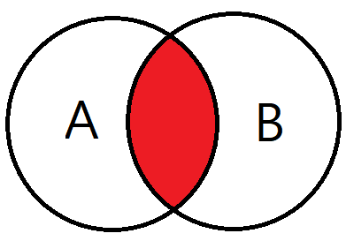

- left outer join

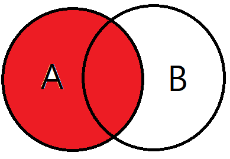

- right outer join

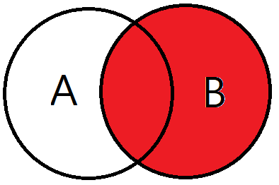

- full outer join

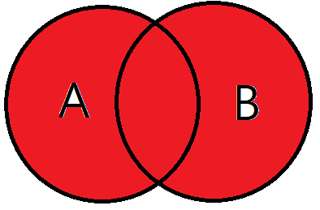

- cross join

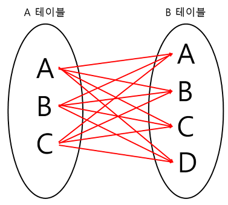

- self join

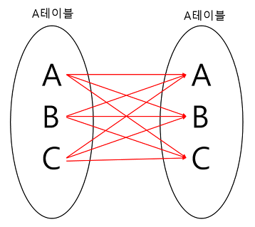

## 3. SQL - Injection

- 해커에 의해 조작된 SQL 쿼리문이 DB에 그대로 전달되어 비정상적 명령을 실행시키는 공격 기법

### (1) 공격 방법

1. 인증 우회

   - 보통 로그인시, id pw를 input창에 입력하게 된다.

   > SELECT * FROM USER WHERE ID="abc" AND PASSWORD="1234";

   - 이 때, id에 쿼리문을 입력해서 악용할 수 있다.

   id에 `1' or '1'='1`를 입력하면...

   > ~ ID = '1' or '1'='1' ~

   가 되면서 항상 True인 구문이 되어버린다. 즉, WHERE 구문이 우회된 채로 SQL 쿼리문이 실행되기 때문에 DB내 모든 사용자 정보가 노출된다.

2. 데이터 노출
   - 시스템에서 발생하는 에러 메시지는, 보통 개발자가 버그를 수정할 때 도움을 받을 수 있게 해준다. 하지만 해커들은 이를 역이용해 악의적인 구문을 삽입하여 에러를 유발시킨다.
   - 예를 들면, GET방식으로 동작하는 URL의 쿼리 스트링을 조작하여 에러를 발생시킨다. 이에 해당하는 오류가 발생하면, 이를 통해 해당 웹앱의 데이터베이스 구조를 유추할 수 있고, 해킹에 활용하게 된다.

### (2) 방어 방법

1. input 값을 받을 때, 특수문자 여부 검사하기
   - 검증 로직을 추가하여 미리 설정한 특수문자들이 들어왔을 때 요청을 막아낸다.
2. SQL 서버 오류 발생 시, 해당하는 에러 메시지 감추기
   - view를 활용하여 원본 DB 테이블에는 접근 권한을 높힌다. 일반 사용자는 view로만 접근하여 에러를 볼 수 없도록 만든다.
3. preparestatement 사용하기
   - preparestatement를 사용하면, 특수문자를 자동으로 escaping 해준다.
   - `PreparedStatement pstmt = conn.prepareStatement(sql)`

## 4. SQL vs NoSQL

MySQL과 같은 SQL을 사용할까, 아니면 MongoDB와 같은 NoSQL을 사용할까?

보통 Spring에서 개발할 때 MySQL을, Node.js에서는 MongoDB를 주로 사용한다.

하지만 단순히 프레임워크에 따라 결정하는 게 아니라, 적합한 데이터베이스를 택해야 한다.

### (1) SQL - 관계형 DB

SQL을 사용하면, RDBMS(관계형 데이터데이스 관리 시스템)

관계형 데이터베이스의 핵심적인 두 특징은

1. 데이터는 **정해진 데이터 스키마에 따라 테이블에 저장**된다.
2. 데이터는 **관계를 통해 여러 테이블에 분산**된다.

즉, 스키마(테이블마다 명확히 정의된 구조)를 준수하지 않은 레코드는 테이블에 추가할 수 없다.

또한, 데이터의 중복을 피하기 위해 '관계'를 이용한다.

### (2) NoSQL - 비관계형 DB

말 그대로 반대이다.

**스키마도 없고, 관계도 없다.**

NoSQL에서는 레코드를 문서라고 부른다. (문서는 보통 Json 형태로 저장됨)

서로 다른 구조의 데이터를 같은 컬렉션에 추가할 수 있다. 따라서 여러 테이블에 조인할 필요 없이 이미 여러 테이블이 한 문서에 있는 것이 NoSQL이다. (Join 개념이 존재하지 않음)

따라서, 조인을 잘 사용하지 않고, 자주 변경되지 않는 데이터일 때 NoSQL을 쓰면 상당히 효율적이다.

### (3) 확장 개념

데이터베이스 서버 확장성은 '수직적'/'수평적' 확장으로 나뉨

- 수직적 확장 : 단순히 DB서버 성능의 향상 (ex. CPU 업그레이드)
- 수평적 확장 : 더 많은 서버가 추가되고 DB가 전체적으로 분산됨을 의미 (하나의 DB에서 작동하지만 여러 호스트에서 작동)

하지만 데이터 저장 방식으로 인해 SQL DB는 일반적으로 수직적 확장만 지원함.

### (4) 장단점

SQL 장점

- 명확하게 정의된 스키마, 데이터 무결성 보장.
- 관계는 각 데이터를 중복없이 한 번만 저장.

SQL 단점

- 덜 유연. 데이터 스키마를 사전에 계획하고 알아야 함. (추후 수정 어려움)
- join문이 많은 복잡한 쿼리가 만들어질 수 있음.
- 대체로 수직적 확장만 가능.

NoSQL 장점

- 유연함. 언제든 데이터 조정과 새 필드 추가 가능.
- 데이터는 애플리케이션이 필요로 하는 형식으로 저장됨. 데이터 읽어오는 속도 빠름.
- 수직/수평적 확장이 가능해서 모든 읽기/쓰기 요청 처리 가능

NoSQL 단점

- 유연성으로 인해 데이터 구조 결정을 미루게 될 수 있음.
- 데이터 중복을 계속 업데이트해야 함
- 데이터가 여러 컬렉션에 중복되어 있기 때문에, 수정 시 모든 컬렉션에서 수행해야 함.

### (5) 선택

SQL

- 관계를 맺고 있는 데이터가 자주 변경될 때,

- 변경될 여지가 없는 명확한 스키마가 사용자와 데이터에게 중요할 때.

NoSQL

- 정확한 데이터 구조를 알 수 없거나, 변경/확장 될 수 있을 때,
- 읽기는 자주 하지만, 변경은 자주 없을 때,
- DB를 수평적으로 확장해야 할 때 (막대한 양의 데이터를 다뤄야 할 때)

하지만 SQL을 선택해서 복잡한 JOIN문을 만들지 않도록 설계하여 단점을 보완할 수도,

NoSQL을 선택해서 중복 데이터를 줄이는 방법으로 설계해서 단점을 보완할 수도 있다.

# 04/11

## 5. 정규화

정규화의 목표  :

- 데이터 중복을 없에고 불필요한 데이터 최소화시킨다. 
- 무결성을 지키고, **이상** 현상 방지한다.
- 테이블 구성을 논리적이고 직관적이게 한다.
- DB구조 확장이 용이해진다.

### (1) 제 1정규화 - 1NF

> 정규화 : Normalization, 정규형 : Normal Form (NF)

테이블 컬럼이 **원자값(하나의 값)을 갖도록** 테이블을 분리시키는 것.

조건 :

- 어떤 릴레이션에 속한 모든 도메인이 원자값만으로 되어 있어야 한다.
- 모든 속성에 반복되는 그룹이 나타나지 않는다.
- 기본키를 사용하여 관련 데이터의 각 집합을 고유하게 식별할 수 있어야 한다.

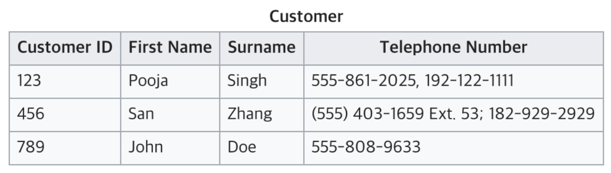

전화번호가 여러개 있어서 원자값이 아님. 따라서 아래와 같이 분리.

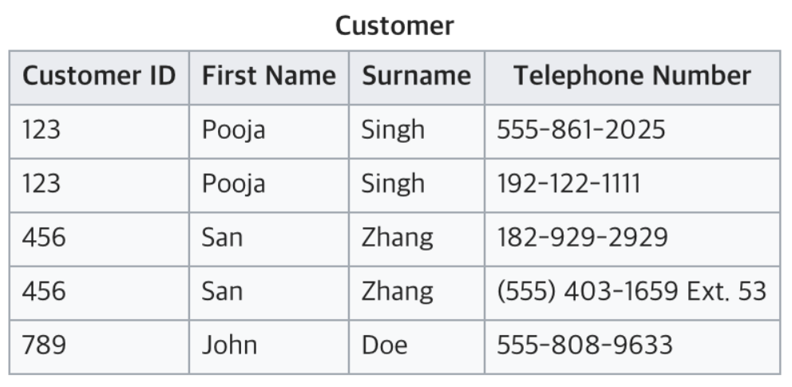

### (2) 제 2정규화 - 2NF

테이블 모든 컬럼이 **완전 함수 종속**을 만족해야 한다.

> = 기본키의 부분집합 키가 결정자가 되어선 안된다.
>
> = 기본키가 복합키로 묶여있을 때, 두 키 중 하나의 키만으로 다른 컬럼을 결정할 수 있으면 안된다.

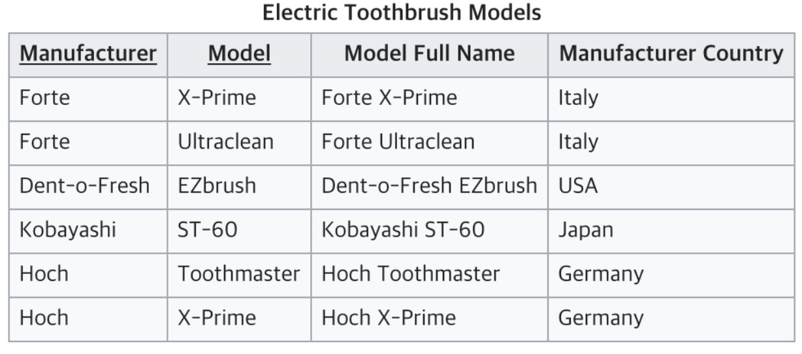 

Manufacturer 과 Model 이 키가 되어 Model Full Name을 알 수 있다.

근데 Manufacturer 만으로 Manufacturer Country를 결정할 수 있다. (부분 함수 종속)

> 기본키만으로 모든 컬럼을 결정하면 "완전 함수 종속" (결정자와 종속자)
>
> 위와 같은 경우는 "부분 함수 종속"
>
> X->Y 이고 Y->Z일 때 Y->X가 아니라면 X->Z이다. "이행적 종속"

따라서 Model은 Manufacturer Country와 연관이 없기 때문에, 부분 함수 종속인 부분을 떼어내서 완전 함수 종속인 두 테이블로 만들 수 있다.

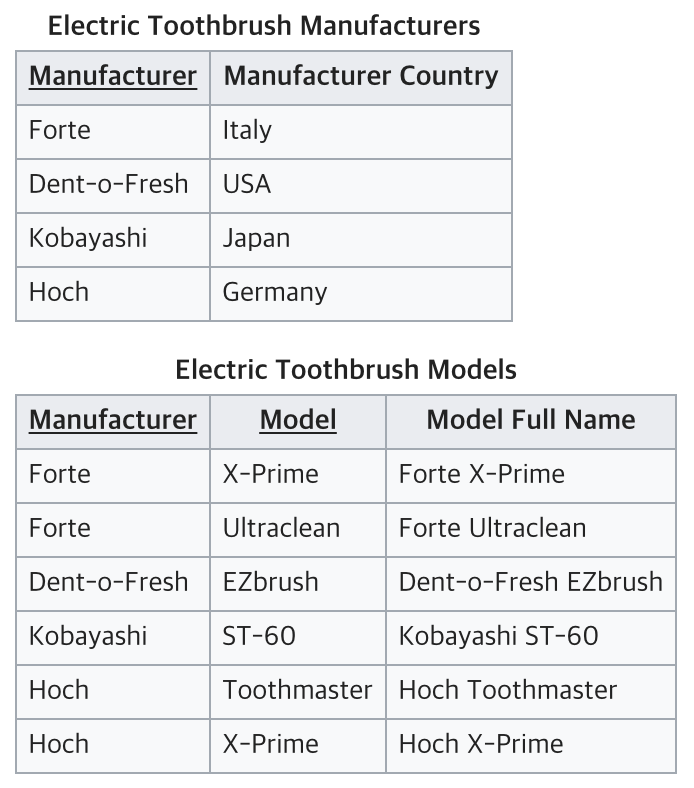

### (3) 제 3정규화 - 3NF

2NF가 진행된 테이블에서 **이행적 종속을 없에기 위해** 테이블을 분리하는 것

 조건 :

- 릴레이션이 2NF에 만족한다.
- 기본키가 아닌 속성들은 기본키에 의존한다.

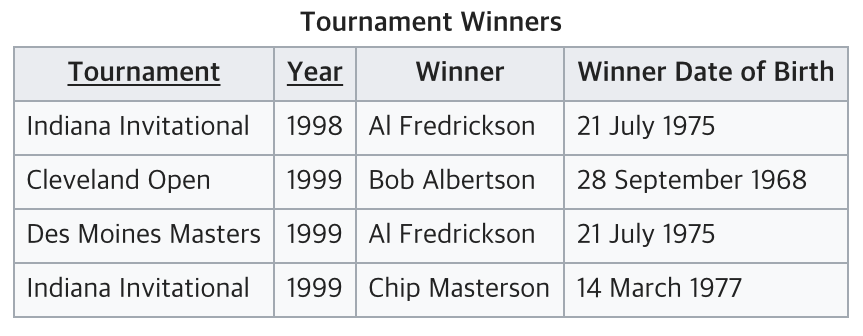

Tournament 와 Year 이 기본키(복합키)

Winner는 이 복합키를 통해 결정.

하지만 Winner Date of Birth는 복합키가 아닌 Winner에 의해 결정. (이행적 종속)

따라서 3NF를 위반하므로, 분리해야 한다.

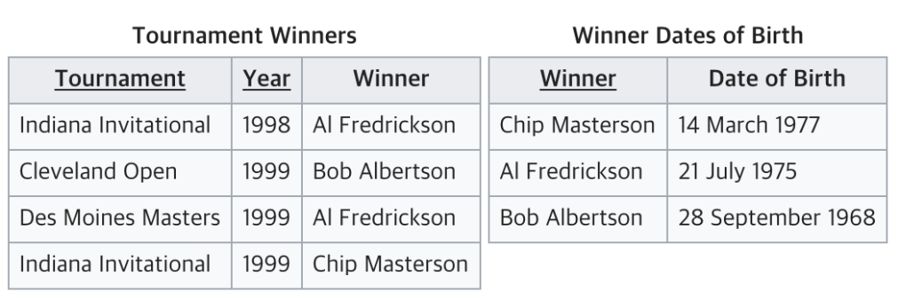

## 6. 이상 - Anomaly

정규화를 해야 하는 이유는 잘못된 테이블의 설계로 인해 Anomaly(이상 현상)가 나타나기 때문이다.

Anomaly란?

### (1) 삽입 이상 - Insertion Anomaly

기본키가 {학번, 수강번호} 인 경우, 수업을 수강하지 않은 학생은 수강번호가 없는 현상이 발생함. 따라서 수강번호를 Null로 할 수밖에 없는데, 기본키는 Null이 될 수 없으므로 Table에 추가할 수 없음.

굳이 삽입하기 위해 '미수강'과 같은 수강번호를 만들어야 함. => 불필요한 데이터를 추가해야 삽입할 수 있는 상황 - Insertion Anomaly

### (2) 갱신 이상 - Update Anomaly

어떤 학생의 전공을 "기계"에서 "컴퓨터"로 바꿀 경우, 모든 Department를 "컴퓨터"로 바꿔야 함. 그러나 일부를 깜빡하고 바꾸지 못한 경우, 제대로 파악할 수 없게 됨. => 일부만 변경하여, 데이터의 불일치가 발생하는 모순의 문제 - Update Anomaly

### (3) 삭제 이상 - Deletion Anomaly

어떤 학생이 수강 철회할 경우, {학번, 전공, 수강번호, 학년} 의 정보 중, 학번, 전공과 같은 학생에 대한 정보도 사라지게 됨.

튜플 삭제로 인해 필요한 데이터가 함께 삭제되는 문제 - Deletion Anomaly

## 7. 인덱스 - Index

추가적인 쓰기 작업과 저장 공간을 활용하여 데이터베이스 테이블의 검색 속도를 향상시키기 위한 자료구조

두꺼운 책의 목차와 비슷하다.

### (1) 장점

- 테이블 검색속도와 성능이 향상된다.
- 데이터들이 정렬된 형태를 갖게 된다. (where문으로 전체를 비교하는 Full Table Scan이 아닌, Index로 검색하게 됨.)

### (2) 단점

- 인덱스 관리를 위한 추가 작업이 필요하다.
- 추가 저장 공간 필요하다.
- 잘못 사용하는 경우 오히려 성능이 저하될 수 있다.

인덱스의 추가/수정/삭제도 필요하기 때문에, 데이터 수정이 잦은 경우 성능이 저하될 수 있다.

또, 데이터의 인덱스를 제거하는 것이 아니라 '사용하지 않음'처리하기 때문에, 수정 작업이 많은 경우 실제 데이터에 비해 인덱스가 과도하게 커지는 현상이 발생할 수 있다.

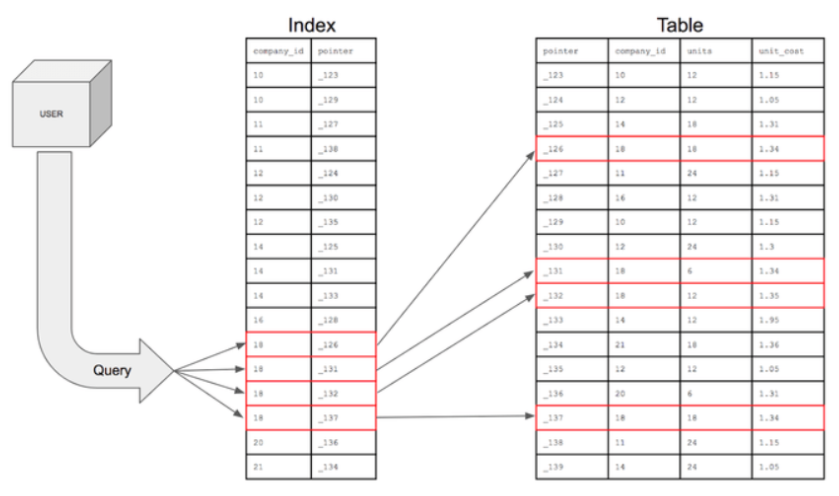

### (3) 인덱스를 사용하면 좋은 경우

데이터의 range가 넓고, 중복이 적을 수록,

조회가 많거나, 정렬된 상태가 유용한 컬럼에 사용하는 것이 좋다.

- 규모가 큰 테이블
- 삽입/수정/삭제가 자주 발생하지 않는 컬럼
- WHERE나 ORDER BY, JOIN등이 자주 사용되는 컬럼
- 데이터의 중복도가 낮은 컬럼

### (4) Why?

그럼에도 불구하고 RDBMS에서 인덱스는 필수이다.

일반적인 OLTP(Online Transaction Processing, 온라인 트랜잭션 처리)시스템에서 데이터 조회 업무가 90% 이상이기 때문이다.

웹 애플리케이션의 백엔드 성능을 높이려고 종종 실행하는 SQL 튜닝이란,

SQL이 위에서 알아본 인덱스를 활용하도록 SQL을 수정하는 것이라고 할 수 있다.

# 04/18

## 8. DB 트랜잭션 (Transaction)

트랜잭션이란? : 데이터베이스의 상태를 변화시키기 위해 수행하는 작업 단위

작업단위 : 많은 SQL 명령문들을 사람이 정하는 기준에 따라 정하는 것

> 예시 ) 사용자 A가 사용자 B에게 만원을 송금한다.
>
> * 이때 DB 작업
>
> 1. 사용자 A의 계좌에서 만원을 차감한다. : UPDATE문으로 A의 잔고 변경
> 2. 사용자 B의 계좌에 만원을 추가한다. : UPDATE문으로 B의 잔고 변경
>
> 현재 작업 단위 : 출금 UPDATE문 + 입금 UPDATE문
>
> -> 이를 통틀어 하나의 트랜잭션이라고 한다.
>
> - 두 쿼리문이 모두 성공적으로 완료되어야 "하나의 트랜잭션"이 완료되는 것이다. 'Commit'
> - 하나라도 실패하면 모든 쿼리문을 취소하고 이전 상태로 돌려놓아야 한다. 'Rollback'

즉, 하나의 트랜잭션을 잘 설계하는 것이 데이터를 다룰 때 많은 이점을 가져다준다.

- Commit : 하나의 트랜잭션이 성공적으로 끝났고, DB가 일관성있는 상태일 때 이를 알려주기 위해 사용하는 연산
- Rollback : 하나의 트랜잭션 처리가 비정상적으로 종료되어 트랜잭션 원자성이 깨진 경우, last consistent state로 roll back할 수 있음.

### (1) 트랜잭션의 특징

- 원자성 - Atomicity
  - 트랜잭션이 DB에 모두 반영되거나, 혹은 전혀 반영되지 않아야 한다.
- 일관성 - Consistency
  - 트랜잭션의 작업 처리 결과는 항상 일관성이 있어야 한다.
- 독립성 - Isolation
  - 둘 이상의 트랜잭션이 동시에 병행 실행되고 있을 때, 어떤 트랜잭션도 다른 트랜잭션 연산에 끼어들 수 없다.
- 지속성 - Durabilty
  - 트랜잭션이 성공적으로 반영되면, 결과는 영구적으로 반영되어야 한다.

### (2) Transaction 관리를 위한 DBMS의 전략

부터 다음주에 알아보자

