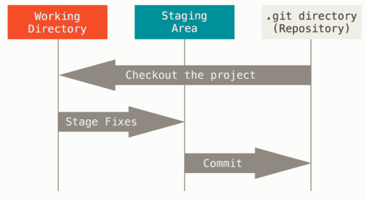
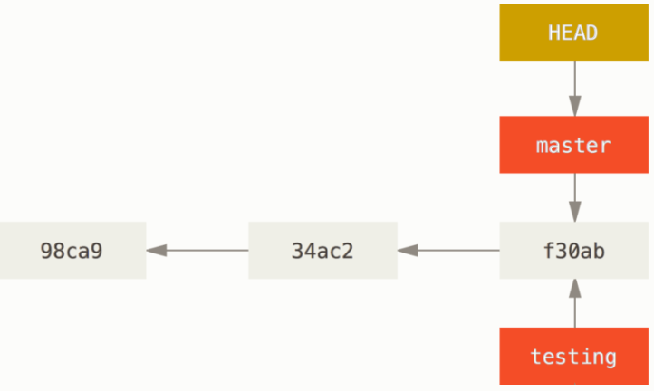
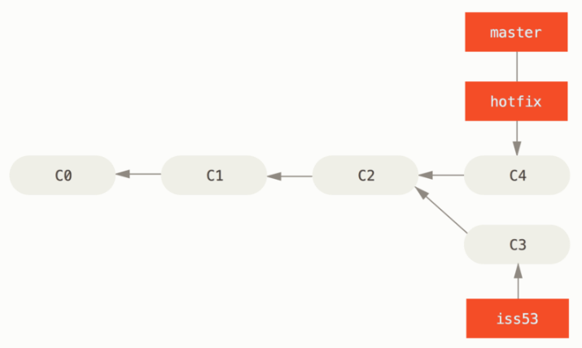
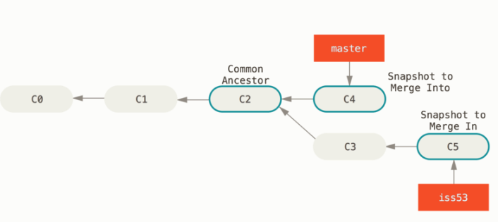
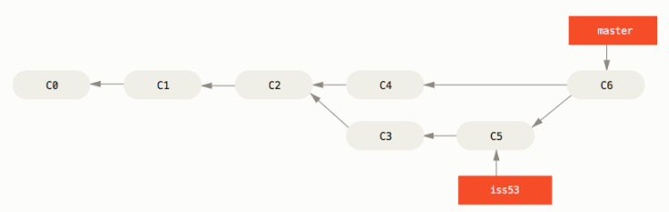

# GIT


# 05/10


## 1. Git 기초


### (1) 거의 모든 명령을 로컬에서 실행한다

거의 모든 명령이 로컬 파일과 데이터만 사용하기 때문에, 네트워크에 있는 다른 컴퓨터는 필요 없다.

어떤 파일의 현재 버전과 한 달 전의 상태를 비교해보고 싶을 때도 Git은 그냥 한 달 전의 파일과 지금의 파일을 로컬에서 찾는다. 비교하기 위해 리모트에 있는 서버에 접근하고 나서 예전 버전을 가져올 필요가 없다는 것이다.

즉, 오프라인 상태이거나 VPN에 연결하지 못해도 상관없다.비행기나 기차에서도 네트워크에 접속하지 않은 상태로 커밋할 수 있다.


### (2) Git의 무결성

Git은 데이터를 저장하기 전 항상 체크섬을 구하고, 그 체크섬으로 데이터를 관리한다.

체크섬은 Git이 사용하는 가장 기본적인 데이터 단위이자 Git의 기본 철학이다.

Git은 SHA-1 해시를 사용하여 체크섬을 만든다. 만들어진 체크섬은 40자 길이의 16진수 문자열이다.

> 체크섬은 이렇게 생겼다 : `24b9da6552252987aa493b52f8696cd6d3b00373`

Git은 모든 것을 해시로 식별하고, 파일 이름도 해시로 저장한다.


### (3) Git은 데이터를 추가만 한다

Git으로 무얼 해도 Git 데이터베이스에는 데이터가 추가되기만 한다. 되돌리거나 삭제할 방법이 없다. 때문에 Giㅅ을 사용하면 프로젝트가 심각하게 망가질 걱정 없이 여러 실험을 할 수 있다.


### (4) 세 가지 상태

- Committed : 데이터가 로컬 데이터베이스에 안전하게 저장된 상태
- Modified : 수정한 파일을 아직 로컬 데이터베이스에 커밋하지 않은 상태
- Staged : 현재 수정한 파일을 곧 커밋할 것이라고 표시한 상태





## 2. Git Commands


### (0) ...

`git status` : 파일이 변경 됐는지 (Staged?)

`git diff` : status + 어떤 내용이 변경됐는지


### (1) 커밋 히스토리 조회하기

`git log`를 입력하면, 해시코드와 함께 커밋 히스토리를 조회할 수 있다.

다양한 옵션들이 있다.

`-p`, `--patch`: 각 커밋의 diff 결과를 보여준다.

`-[숫자]` : [숫자] 만큼 최근 기록을 보여준다.

> `git log -p -2` : 최근 두 커밋의 diff 결과를 보여준다.

`--stat` : 각 커밋의 통계 정보를 조회한다.

`--pretty` : 기본 형식 이외 여러 가지 중 선택해서 히스토리르 볼 수 있다.

> `git log --pretty=format:"%h - %an, %ar : %s`
>
> 짧은 길이 커밋 해시 - 저자 이름, 저자 상대적 시각 : 요약


이 외에도 조회 제한조건을 걸거나, 머지 커밋만 제외하는 등의 옵션도 있다.


### (2) 되돌리기

커밋을 재작성하는 건 간단히 `git command --amend`로 처리할 수 있다.

```
git commit -m 'initial commit'
git add forgotten_file
git commit --amend
```

위 세 줄의 명령어는 모두 커밋 한 개로 기록된다.


원래는 `checkout` 명령어로 되돌리기를 했는데, 기능이 너무 많은 관계로

`switch` 와 `restore`로 분기됐다.

`switch` : 브랜치 변경 부분만 담당한다.

`restore` : 

- `git restore --staged [file name]`: `git add`를 통해 stage에 넣은 내용을 다시 빼는 것

- `git restore --source [commit hash] [file name]`을 사용하면 특정 커밋으로도 복구가 가능하다.


## 3. Git 브랜치


### (1) 브랜치란?

Git은 데이터를 Change Set이나 변경사항(Diff)으로 기록하지 않고 일련의 스냅샷으로 기록한다.

커밋을 하면, Git은 현 Staging Area에 있는 데이터의 스냅샷에 대한 포인터, 저자나 커밋 메시지 같은 메타 데이터, 이전 커밋에 대한 포인터 등을 포함하는 커밋 개체(커밋 Object)를 저장한다.

이전 커밋 포인터가 있기 때문에 현재 커밋이 무엇을 기준으로 바뀌었는지도 알 수 있는 것이다.


Git의 브랜치는 커밋 사이를 가볍게 이동할 수 있는 포인터와 같은 것이다.

기본적으로 Git은 master 브랜치를 만든다. 처음 커밋하면 master 브랜치가 생성된 커밋을 가리키게 되고, 이후 커밋이 만들어질 때마다 master 브랜치는 자동으로 마지막 커밋을 가리키게 된다.


새 브랜치를 만들기 위해, `git branch [name]` 명령어를 쓸 수 있다.

새로 만든 브랜치도 지금 작업하고 있던 마지막 커밋을 가리키게 된다.

지금 작업중인 브랜치가 무엇인지 판단하는 특수한 포인터 'HEAD'가 있다. `git branch`는 생성만 하고 옮기지는 않으므로, HEAD는 아직 master를 가리키고 있게 된다.



여기서  `switch`를 사용해 작업 브랜치를 변경할 수 있다.


### (2) Merge


- Fast-forward Merge

issue53이 발생해서 따로 iss53브랜치로 분기해서 작업하고 있는 와중에,

C2에 있던 master 브랜치가 서비스 배포 중 버그가 발생했다.

이 때 hotfix 브랜치를 생성해서 버그를 해결하고 C4로 커밋한다.

master 브랜치에 hotfix를 merge하면 버그를 해결할 수 있다.



C2를 가리키던 Master 브랜치가 hotfix 브랜치를 먹은 모습 (`git switch master`, `git merge hotfix`)

이후 필요 없어진 hotfix 브랜치는 삭제하면 된다. (`git brach -d hotfix`)


- 3-way Merge

위와 같은 상태에서, iss53브랜치에서 issue53을 해결했다.

이미 분기된 master와 iss53을 merge하려면, 공통의 조상인 C2와 함께 3-way merge해야 한다. (auto-commit 된다.)



 3-way Merge 의 결과를 별도의 커밋으로 만들고 나서 해당 브랜치가 그 커밋을 가리키도록 이동시킨다.




### (3) 충돌

Merge 하는 두 브랜치에서 같은 파일의 한 부분을 동시에 수정하고 Merge 하면 Git은 해당 부분을 Merge 하지 못한다. 변경사항의 충돌을 개발자가 해결하지 않는 한, Merge 과정을 진행할 수 없다.

`git status`로 확인하면, 충돌이 일어난 파일은 unmerged 상태로 표시된다.


### (4) 브랜치 전략

자주 쓰이는 브랜치 전략 두가지를 소개한다.

1. git-flow : 5가지 브랜치를 이용해 운영하는 브랜치 전략
2. github-flow : master 브랜치와 Pull Request를 활용한 단순한 브랜치 전략


#### 1. git-flow

- 메인 브랜치 :
  - master : 제품으로 출시될 수 있는 브랜치
  - develop : 다음 출시 버전을 개발하는 브랜치
- 보조 브랜치 :
  - feature : 기능을 개발하는 브랜치
  - release : 이번 출시 버전을 준비하는 브랜치
  - hotfix : 출시 버전에서 발생한 버그를 수정하는 브랜치

1. 개발자가 develop 브랜치로부터 개발할 기능을 위한 feature 브랜치를 만든다.
2. feature 브랜치에서 완성된 기능을 develop 브랜치에 merge한다.
3. 이번 배포 버전의 기능들이 모두 develop 브랜치에 merge됐다면, release 브랜치를 생성한다.
4. release 브랜치에서 발생한 오류는 release에서 수정한다. 마침에 QA가 끝났다면, master 브랜치로 merge한다. bugfix가 있었다면 develop 브랜치에도 merge한다.
5. 제품(master)에서 버그가 발생하면, hotfix 브랜치를 만든다.
6. hotfix 브랜치에서 버그 픽스가 끝나면, develop과 master 브랜치에 각각 merge한다.


#### 2. github-flow

1. 기능 개발, 버그 픽스, 혹은 어떤 이유로든 branch를 생성한다.
   - 하지만 git-flow와 같은 체계적인 분류가 없기 때문에, 브랜치 이름은 의도를 잘 드러내야 한다.
2. 브랜치에서 개발을 하고 상세한 커밋 메세지를 작성한다.
3. pull request를 생성한다.
4. 충분히 검토한다.
5. 리뷰가 끝나면, 실제 서버(혹은 테스트 환경)에 배포한다.
6. 이상이 없다면, master에 merge후 push하고, 즉시 배포한다. (배포 자동화 권장)


#### 비교

git-flow는 주기적으로 배포하는 서비스에 적합하고, 많은 IDE가 지원하는 유명한 전략이다.

github-flow는 브랜치 전략이 단순해서, 접근성이 좋고, CI(지속적 통합), CD(지속적 배포)가 자연스럽게 이루어진다.

전략 선택 :

1. 한 달 이상 긴 호흡으로 개발하여 주기적으로 배포하고, QA및 배포, hotfix 등을 수행할 여력이 있는 팀이라면 git-flow가 적합.
2. 항상 release될 필요가 있는 서비스와 지속적으로 테스트하고 배포하는 팀이라면 github-flow와 같은 단순한 workflow가 적합.


# 출처

https://github.com/gyoogle/tech-interview-for-developer

https://github.com/JaeYeopHan/Interview_Question_for_Beginner/tree/master/Database

https://www.youtube.com/watch?v=jeaf8OXYO1g

https://www.youtube.com/watch?v=JsRD2AWxxFg
